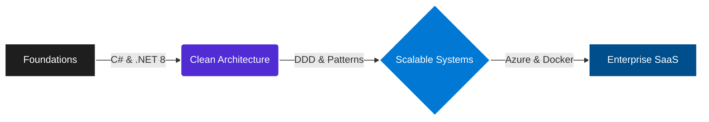

  <h1 align="center">Gabriel León</h1>
  
  <h3 align="center">
    Software Engineering Student @USMP | .NET Ecosystem & Cloud Architecture
  </h3>

  

    <em>Bridging the gap between Academic Theory and Enterprise-Grade Solutions.</em>
  

  

    
    
  

---

### 👨‍💻 Professional Summary

Actualmente cursando el **7.º Ciclo de Ingeniería de Computación y Sistemas en la USMP**. Mi enfoque ha evolucionado de la escritura de código funcional al diseño de **sistemas distribuidos y arquitecturas escalables**.

A diferencia del estudiante promedio, utilizo mis proyectos académicos como laboratorios de **I+D (Investigación y Desarrollo)**, aplicando rigurosamente patrones de diseño (DDD, CQRS) y principios SOLID. Mi objetivo no es solo que el software compile, sino que sea mantenible, escalable y eficiente en costos (Cloud FinOps).

* **Enfoque Actual:** Profundizando en **Arquitectura de Software** e **Inteligencia Artificial**.
* **Capacidad Técnica:** Lectura fluida de documentación técnica compleja (Microsoft Learn, AWS Whitepapers) e implementación de estándares de industria.

---

### 🧠 Architecture & Skill Flow

### 🛠️ Technical Arsenal

Me especializo en el ecosistema Microsoft, complementado con herramientas modernas de contenedorización y frontend.

| Domain | Technologies & Concepts |
| :--- | :--- |
| **Backend Core** |    |
| **Architecture** | Domain-Driven Design (DDD), CQRS, Microservices, Clean Architecture, RESTful APIs |
| **Cloud & DevOps** |    |
| **Data & AI** |   Semantic Kernel |
| **Frontend** |   TailwindCSS |

---

### 🎓 Academic Focus & R&D (USMP 7th Semester)

Vinculando la malla curricular con implementaciones reales en GitHub:

* **Software Architecture:** Aplicación de *Clean Architecture* y desacoplamiento de dependencias en sistemas .NET.
* **Artificial Intelligence:** Integración de modelos de visión computacional y RAG (Retrieval-Augmented Generation) con backends robustos.
* **Financial Management:** Análisis de costos en Azure y optimización de recursos (preparación para entornos SaaS reales).

---

### 🚀 Featured Projects

#### 📦 [Distributed-Logistics-Platform](https://github.com/SykoZzz/Distributed-Logistics-Platform)
> **Event-Driven Microservices orchestrated with .NET Aspire.**
> Sistema de logística post-compra (Inventario, Pagos, Envíos) diseñado con .NET Aspire para orquestación local y Azure Container Apps para despliegue.
* **Tech:** .NET Aspire, YARP, RabbitMQ (MassTransit), Redis, OpenTelemetry.
* **Key Achievement:** Implementación del patrón **Transactional Outbox** para garantizar consistencia eventual y desacoplamiento total entre servicios ante fallos.

#### 🤖 [CodeMentor-AI](https://github.com/SykoZzz/CodeMentor-AI)
> **RAG-powered Developer Assistant using Semantic Kernel.**
> Tutor inteligente de documentación técnica que utiliza arquitectura híbrida (.NET + Python) para permitir a desarrolladores "chatear" con documentación de librerías.
* **Tech:** .NET 8, Semantic Kernel, Python (LangChain), Qdrant (Vector DB).
* **Key Achievement:** Desarrollo de un pipeline de **RAG Agéntico** capaz de consultar APIs externas (GitHub) para enriquecer las respuestas generadas con código real.

---

  

    <small>⚡ Fun Fact: Main Nautilus en LoL. En la Grieta protejo a mi equipo con el mismo celo que protejo la integridad de mis APIs.</small>
  

  

    © 2026 Gabriel León | Building the future, line by line.
  

